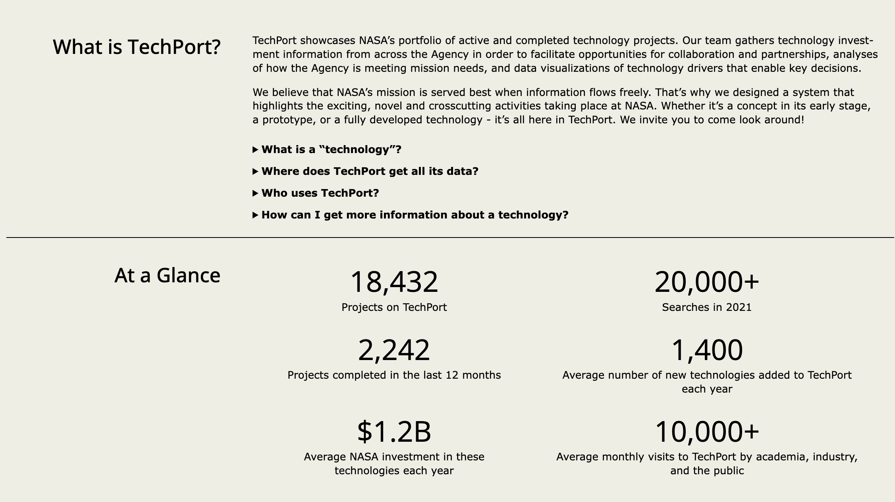

<div align="center">

[](https://techport.nasa.gov&#x2F;home)

# Nasa<a id="nasa"></a>

TechPort RESTful API


</div>

## Table of Contents<a id="table-of-contents"></a>

<!-- toc -->

- [Requirements](#requirements)
- [Installation](#installation)
- [Getting Started](#getting-started)
- [Async](#async)
- [Raw HTTP Response](#raw-http-response)
- [Reference](#reference)
  * [`nasatechport.organization.get_information`](#nasatechportorganizationget_information)
  * [`nasatechport.organization.get_list_by_name`](#nasatechportorganizationget_list_by_name)
  * [`nasatechport.organization.list_types`](#nasatechportorganizationlist_types)
  * [`nasatechport.project.find_matching_projects`](#nasatechportprojectfind_matching_projects)
  * [`nasatechport.project.get_info`](#nasatechportprojectget_info)
  * [`nasatechport.project.list_available_ids`](#nasatechportprojectlist_available_ids)
  * [`nasatechport.resource.get_specification`](#nasatechportresourceget_specification)

<!-- tocstop -->

## Requirements<a id="requirements"></a>

Python >=3.7

## Installation<a id="installation"></a>
<div align="center">
  <a href="https://konfigthis.com/sdk-sign-up?company=NASA&serviceName=TechPort&language=Python">
    
  </a>
</div>

## Getting Started<a id="getting-started"></a>

```python
from pprint import pprint
from nasa_tech_port_python_sdk import NasaTechPort, ApiException

nasatechport = NasaTechPort()

try:
    get_information_response = nasatechport.organization.get_information(
        organization_id=1,
    )
    print(get_information_response)
except ApiException as e:
    print("Exception when calling OrganizationApi.get_information: %s\n" % e)
    pprint(e.body)
    pprint(e.headers)
    pprint(e.status)
    pprint(e.reason)
    pprint(e.round_trip_time)
```

## Async<a id="async"></a>

`async` support is available by prepending `a` to any method.

```python
import asyncio
from pprint import pprint
from nasa_tech_port_python_sdk import NasaTechPort, ApiException

nasatechport = NasaTechPort()


async def main():
    try:
        get_information_response = await nasatechport.organization.aget_information(
            organization_id=1,
        )
        print(get_information_response)
    except ApiException as e:
        print("Exception when calling OrganizationApi.get_information: %s\n" % e)
        pprint(e.body)
        pprint(e.headers)
        pprint(e.status)
        pprint(e.reason)
        pprint(e.round_trip_time)


asyncio.run(main())
```

## Raw HTTP Response<a id="raw-http-response"></a>

To access raw HTTP response values, use the `.raw` namespace.

```python
from pprint import pprint
from nasa_tech_port_python_sdk import NasaTechPort, ApiException

nasatechport = NasaTechPort()

try:
    get_information_response = nasatechport.organization.raw.get_information(
        organization_id=1,
    )
    pprint(get_information_response.body)
    pprint(get_information_response.body["organization"])
    pprint(get_information_response.headers)
    pprint(get_information_response.status)
    pprint(get_information_response.round_trip_time)
except ApiException as e:
    print("Exception when calling OrganizationApi.get_information: %s\n" % e)
    pprint(e.body)
    pprint(e.headers)
    pprint(e.status)
    pprint(e.reason)
    pprint(e.round_trip_time)
```


## Reference<a id="reference"></a>
### `nasatechport.organization.get_information`<a id="nasatechportorganizationget_information"></a>

Get an organization and its information.

#### 🛠️ Usage<a id="🛠️-usage"></a>

```python
get_information_response = nasatechport.organization.get_information(
    organization_id=1,
)
```

#### ⚙️ Parameters<a id="⚙️-parameters"></a>

##### organization_id: `int`<a id="organization_id-int"></a>

Organization Id.

#### 🔄 Return<a id="🔄-return"></a>

[`OrganizationGetInformationResponse`](./nasa_tech_port_python_sdk/pydantic/organization_get_information_response.py)

#### 🌐 Endpoint<a id="🌐-endpoint"></a>

`/api/organizations/{organizationId}` `get`

[🔙 **Back to Table of Contents**](#table-of-contents)

---

### `nasatechport.organization.get_list_by_name`<a id="nasatechportorganizationget_list_by_name"></a>

Returns a list of organizations that match a given name.

#### 🛠️ Usage<a id="🛠️-usage"></a>

```python
get_list_by_name_response = nasatechport.organization.get_list_by_name(
    name="string_example",
)
```

#### ⚙️ Parameters<a id="⚙️-parameters"></a>

##### name: `str`<a id="name-str"></a>

Organization Name to filter on.

#### 🔄 Return<a id="🔄-return"></a>

[`OrganizationGetListByNameResponse`](./nasa_tech_port_python_sdk/pydantic/organization_get_list_by_name_response.py)

#### 🌐 Endpoint<a id="🌐-endpoint"></a>

`/api/organizations` `get`

[🔙 **Back to Table of Contents**](#table-of-contents)

---

### `nasatechport.organization.list_types`<a id="nasatechportorganizationlist_types"></a>

Returns a list of available organization types, including set-aside and MSI types.

#### 🛠️ Usage<a id="🛠️-usage"></a>

```python
list_types_response = nasatechport.organization.list_types()
```

#### 🔄 Return<a id="🔄-return"></a>

[`OrganizationListTypesResponse`](./nasa_tech_port_python_sdk/pydantic/organization_list_types_response.py)

#### 🌐 Endpoint<a id="🌐-endpoint"></a>

`/api/organizations/types` `get`

[🔙 **Back to Table of Contents**](#table-of-contents)

---

### `nasatechport.project.find_matching_projects`<a id="nasatechportprojectfind_matching_projects"></a>

Returns a list of projects matching the search term.

#### 🛠️ Usage<a id="🛠️-usage"></a>

```python
find_matching_projects_response = nasatechport.project.find_matching_projects(
    project_id=1,
    search_query="string_example",
    mission_directorate="string_example",
    program="string_example",
    title_search="string_example",
)
```

#### ⚙️ Parameters<a id="⚙️-parameters"></a>

##### project_id: `int`<a id="project_id-int"></a>

The specific ID of the project requested.

##### search_query: `str`<a id="search_query-str"></a>

The term on which to search. Will check all project fields for the this term.

##### mission_directorate: `str`<a id="mission_directorate-str"></a>

The mission directorate acronym of the projects. Used to filter.

##### program: `str`<a id="program-str"></a>

The program acronym of the projects. Used to filter.

##### title_search: `str`<a id="title_search-str"></a>

The term on which to search. Will check only project titles for the this term.

#### 🔄 Return<a id="🔄-return"></a>

[`ProjectFindMatchingProjectsResponse`](./nasa_tech_port_python_sdk/pydantic/project_find_matching_projects_response.py)

#### 🌐 Endpoint<a id="🌐-endpoint"></a>

`/api/projects/search` `get`

[🔙 **Back to Table of Contents**](#table-of-contents)

---

### `nasatechport.project.get_info`<a id="nasatechportprojectget_info"></a>

Returns information about a specific technology project.

#### 🛠️ Usage<a id="🛠️-usage"></a>

```python
get_info_response = nasatechport.project.get_info(
    project_id=1,
)
```

#### ⚙️ Parameters<a id="⚙️-parameters"></a>

##### project_id: `int`<a id="project_id-int"></a>

ID of project to fetch

#### 🔄 Return<a id="🔄-return"></a>

[`Project`](./nasa_tech_port_python_sdk/pydantic/project.py)

#### 🌐 Endpoint<a id="🌐-endpoint"></a>

`/api/projects/{projectId}` `get`

[🔙 **Back to Table of Contents**](#table-of-contents)

---

### `nasatechport.project.list_available_ids`<a id="nasatechportprojectlist_available_ids"></a>

Returns a list of available technology project IDs.

#### 🛠️ Usage<a id="🛠️-usage"></a>

```python
list_available_ids_response = nasatechport.project.list_available_ids(
    updated_since="1970-01-01",
)
```

#### ⚙️ Parameters<a id="⚙️-parameters"></a>

##### updated_since: `date`<a id="updated_since-date"></a>

ISO 8601 full-date in the format YYYY-MM-DD. Filters the list of available ID values by their lastUpdated parameter.

#### 🔄 Return<a id="🔄-return"></a>

[`ProjectListAvailableIdsResponse`](./nasa_tech_port_python_sdk/pydantic/project_list_available_ids_response.py)

#### 🌐 Endpoint<a id="🌐-endpoint"></a>

`/api/projects` `get`

[🔙 **Back to Table of Contents**](#table-of-contents)

---

### `nasatechport.resource.get_specification`<a id="nasatechportresourceget_specification"></a>

Returns the swagger specification for the API.

#### 🛠️ Usage<a id="🛠️-usage"></a>

```python
nasatechport.resource.get_specification()
```

#### 🌐 Endpoint<a id="🌐-endpoint"></a>

`/api` `get`

[🔙 **Back to Table of Contents**](#table-of-contents)

---


## Author<a id="author"></a>
This Python package is automatically generated by [Konfig](https://konfigthis.com)
